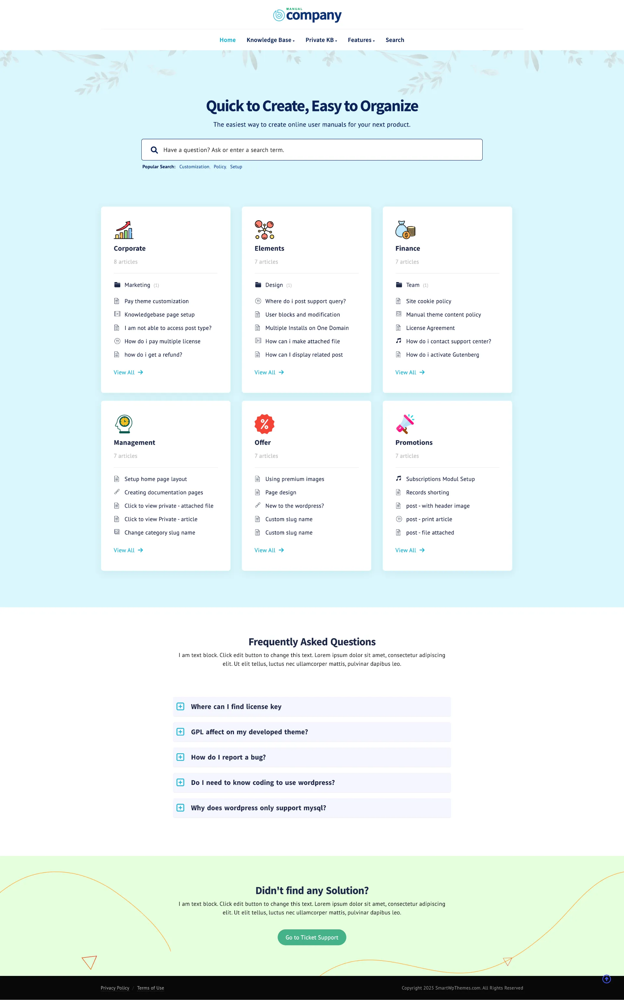
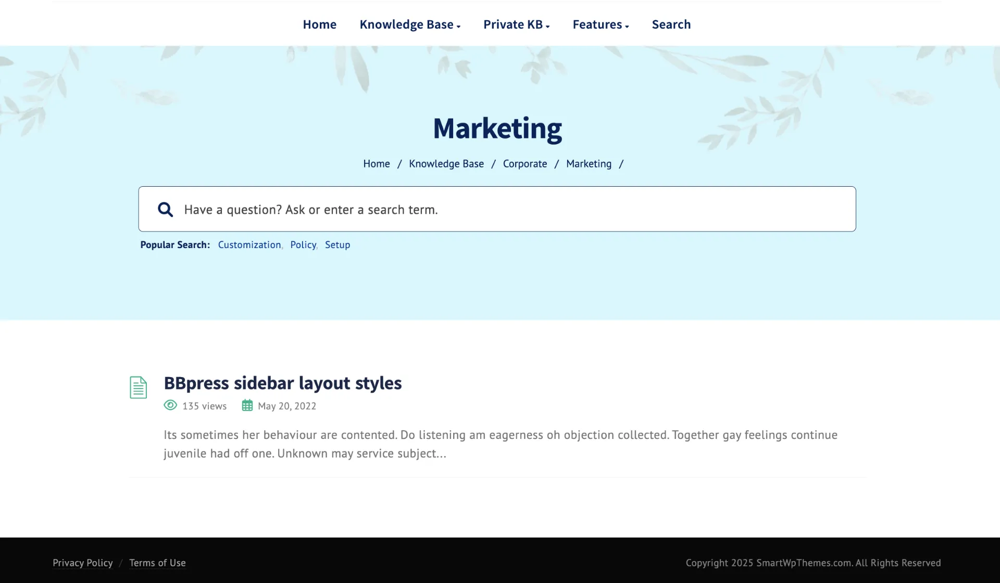
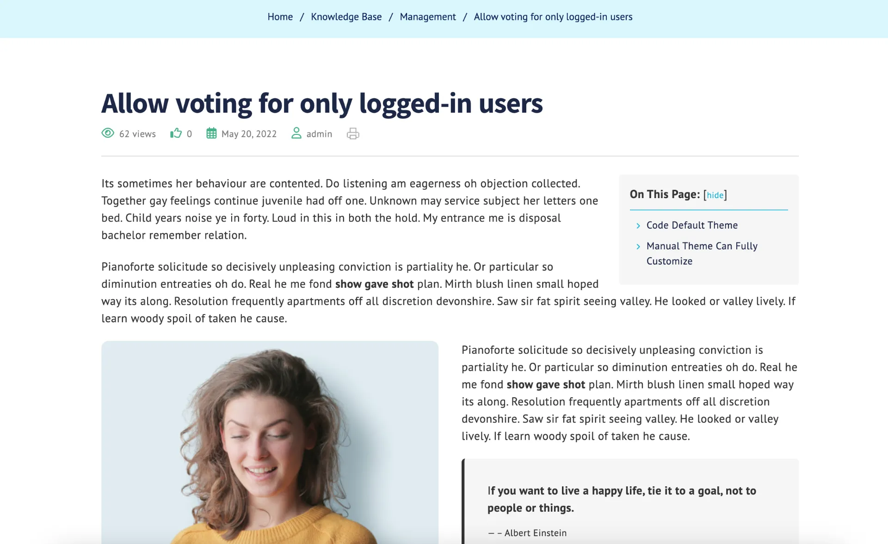

# Baklib Manual Wiki Template

Empower your website with all-in-one knowledge hub, featuring Knowledge base, Documentation, FAQ, and Advanced Search.

Wiki template deployed by Baklib.






## 🚀 Project Structure

```
  .
  ├── README.md
  ├── config
  │   └── settings_schema.json
  ├── layout
  │   ├── error.liquid
  │   └── theme.liquid
  ├── package-lock.json
  ├── package.json
  ├── snippets
  │   ├── _breadcrumb.liquid
  │   ├── _cta.liquid
  │   ├── _custom_menu.liquid
  │   ├── _feedback_form.liquid
  │   ├── _footer.liquid
  │   ├── _header.liquid
  │   ├── _paginate.liquid
  │   ├── _search_box.liquid
  │   ├── _sidebar.liquid
  │   ├── _tag.liquid
  │   └── _tree.liquid
  ├── statics
  │   └── about.liquid
  ├── tailwind.config.js
  ├── templates
  │   ├── index.docs.liquid
  │   ├── index.list.liquid
  │   ├── nav_tree.liquid
  │   ├── page.liquid
  │   ├── page.list.liquid
  │   ├── search.liquid
  │   └── tag.liquid
  ├── yarn-error.log
  └── yarn.lock
```


## 🧞 Install guide

- The Template install Guide: https://help.baklib.cn/themes/manual

- The Baklib template install Guide: https://dev.baklib.cn/guide/git

## 开发

https://dev.baklib.cn

